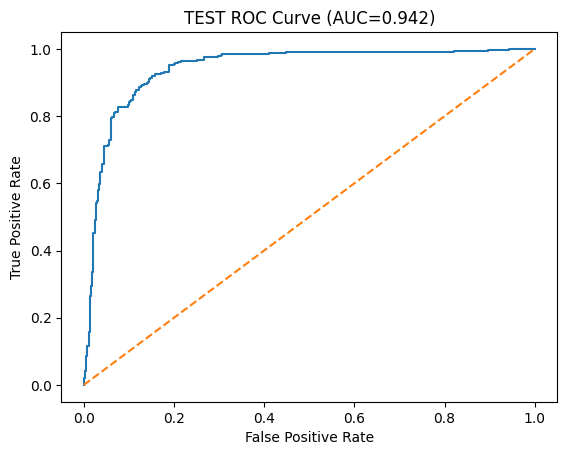
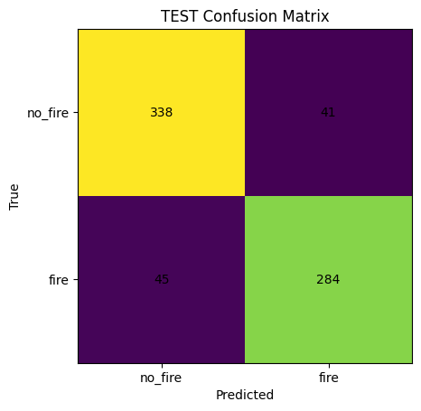

# WildFireDetector

WildFireDetector is a binary image-classification project that compares simple logistic-regression baselines against a small convolutional neural network for wildfire vs. no-fire detection.

The project is structured around a reproducible workflow:
- prepare a canonical train/validation/test split from raw images
- train baseline logistic-regression models on downsampled grayscale features
- train a small CNN for comparison
- save metrics, ROC curves, confusion matrices, and summary tables for analysis

## Project Background

This public repository is a cleaned-up adaptation of earlier wildfire-detection work I contributed to during an internship with Other Orb LLC, followed by a class-project extension where I added a logistic-regression baseline and a more explicit comparison pipeline.

The goal of this version is to present the project in a way that is reproducible and interview-friendly:
- preserve the core wildfire-classification problem
- show the difference between a simple baseline and a stronger CNN approach
- package the work as a standalone public project rather than an internal or classroom-only artifact

This repository is intended as a public-facing adaptation, not a mirror of internship code. It does not include proprietary code, private datasets, or internal company materials.

## Highlights

- Reproducible dataset-splitting script with explicit labeling rules and split metadata
- Baseline comparison across logistic regression and CNN models
- Saved figures and JSON outputs for each experiment run
- Lightweight data-loading utilities and tests that do not require the original dataset

## Results Snapshot

The strongest run in the current project copy is the `64x64 RGB + augmentation + wildfire_cnn_v2` experiment:

| Model | Variant | Resolution | Accuracy | AUC | Precision | Recall | F1 |
|-------|---------|------------|----------|-----|-----------|--------|----|
| CNN | `rgb-wildfire_cnn_v2-aug` | 64x64 | 0.932 | 0.979 | 0.967 | 0.884 | 0.924 |

Additional results are summarized in [results/summary_table.md](results/summary_table.md) and [results/summary_metrics.md](results/summary_metrics.md).

Recent experiment note:

- `256x256` grayscale did not outperform the current `64x64` baseline, so larger input size alone is not the main improvement path for this project.
- `64x64 RGB + augmentation + wildfire_cnn_v2` did outperform the original grayscale baseline substantially, which makes RGB training and augmentation the new default direction.

## Why Include Logistic Regression?

The logistic-regression models are there on purpose. I added them in the class-project adaptation to establish a simple baseline before comparing against the CNN.

That comparison makes the project stronger because it answers a more useful question than "can a CNN classify these images?":
- how much performance do we get from a simple linear baseline?
- when does a higher-capacity model justify its extra complexity?
- what do we lose when we flatten the image and remove most spatial structure?

In the current results, the CNN outperforms the logistic-regression baselines clearly, which helps justify the move to the more expressive model.

## Example Artifacts

### CNN ROC Curve



### CNN Confusion Matrix



## Interactive Classification

The repository now includes two ways to classify arbitrary images with the saved CNN checkpoints:

1. Batch CLI for one image, many images, or entire folders:

```bash
PYTHONPATH=. python scripts/classify_images.py path/to/image_or_folder --model cnn_64x64_rgb_aug_v2 --tta
```

2. Local desktop app with file/folder selection:

```bash
PYTHONPATH=. python app/classifier_app.py
```

The default classifier is the stronger `cnn_64x64_rgb_aug_v2` checkpoint. The `ensemble` option still averages the older legacy CNN checkpoints if you want a comparison path.

## Repository Layout

- `scripts/prepare_dataset.py`: builds canonical `train/`, `val/`, and `test/` splits from raw images
- `src/data_utils.py`: loads image splits and creates feature matrices
- `src/train_logreg.py`: trains logistic-regression baselines and saves metrics plus figures
- `cnn/train_cnn.py`: trains the CNN comparison model
- `results/`: saved `results.json` files and aggregate summary tables
- `figures/`: ROC curves, confusion matrices, learning curves, and weight visualizations
- `tests/`: lightweight tests for data-loading and preprocessing behavior

## Setup

```bash
python3 -m venv .venv
source .venv/bin/activate
pip install -r requirements.txt
```

For the CNN experiments, install PyTorch separately using the instructions for your platform from [pytorch.org](https://pytorch.org/).

## Reproducing The Pipeline

1. Prepare the dataset splits:

```bash
python scripts/prepare_dataset.py --input data/raw --output data/splits --val 0.15 --test 0.15 --seed 42 --mode copy --keep-unknown
```

2. Train the logistic-regression baseline:

```bash
python -m src.train_logreg --size 16
```

3. Train the CNN comparison model:

```bash
python cnn/train_cnn.py --size 64 --epochs 25
```

Recommended stronger run:

```bash
python cnn/train_cnn.py --size 64 --rgb --augment --arch wildfire_cnn_v2 --run-name rgb_aug_v2 --epochs 25
```

4. Regenerate the summary tables:

```bash
python scripts/summarize_results.py
```

## Testing

The included tests use temporary synthetic image data, so they can run without the original wildfire dataset:

```bash
PYTHONPATH=. python -m pytest tests
```

The new inference utilities are also covered with lightweight tests for file discovery and preprocessing behavior.

## Training Roadmap

The concrete next-step plan for augmentation, RGB experiments, and outside-dataset expansion is documented in [report/TRAINING_PLAN.md](report/TRAINING_PLAN.md).

## Data Note

The original dataset is not included in this public-facing copy. See [data/README.md](data/README.md) for the expected directory layout and how the project uses `data/raw/` and `data/splits/`.

This also means the repository is safe to share publicly as a project adaptation: it documents the workflow and results without exposing private or non-public source materials.
